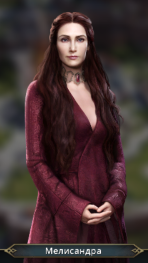

<h3>Описание</h3>

Скрипт на python для автоматического прохождения браузерной игры "Игра Престолов"

Использует модуль OpenCV для сопоставления: скрин участка игры (анкер на который нужно ссылаться для нажатия ) -> тот участор экрана, на который необходимо нажать.

В папке jupyter -> для Jupyter Notebook. В папке script -> собранный скрипт на python.

